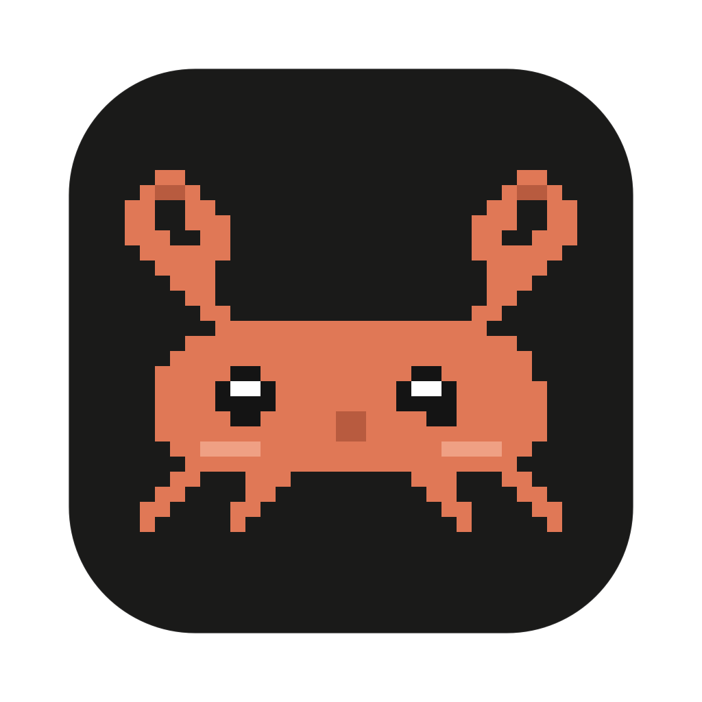
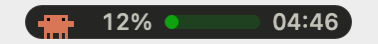
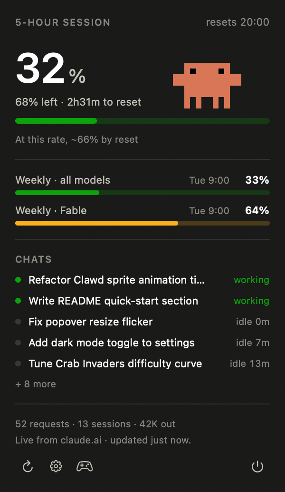

  

<h1 align="center">CrabBar</h1>

  Claude Code usage, live in your macOS menu bar.

  

  

## Install

1. Download `CrabBar-x.y.z.zip` from the [latest release](https://github.com/dorfurman/claude-top-bar/releases/latest)
2. Unzip and drag **CrabBar.app** into **Applications**
3. Launch it, click the pill, and sign in with Claude

Signed and notarized — no Gatekeeper warnings. Requires macOS 14+ on Apple silicon.
CrabBar checks for new releases and offers updates from the right-click menu.

## Build from source

Requires Xcode command line tools (Apple silicon).

    git clone https://github.com/dorfurman/claude-top-bar
    cd claude-top-bar
    ./build.sh
    open CrabBar.app

Without a Developer ID cert the app is ad-hoc signed — fine on your own Mac.

## Features

- **Real numbers, not estimates** — the percentage of your 5-hour limit comes straight
  from claude.ai, the same figure Claude Code's `/usage` shows
- **Every window your plan has** — weekly all-models, weekly Opus/Sonnet, each with its
  own meter and reset time
- **Projection** — "at this rate you run out in 52m"
- **Local breakdown** — which model is eating the window, activity per 10 minutes,
  and daily bars for the last 7 days
- **Live chats** — sessions active in the last 30 minutes, green while Claude is
  working, grey once it's waiting on you
- **Notifications** when you cross usage thresholds
- **Clawd** — the crab in your menu bar plays the occasional trick, and there may or
  may not be a hidden game of Crab Invaders

Left-click the pill for the popover, right-click for the menu. Settings covers the
pill display, notifications, animations, and launch at login.

